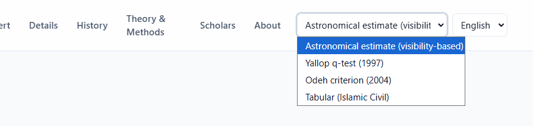
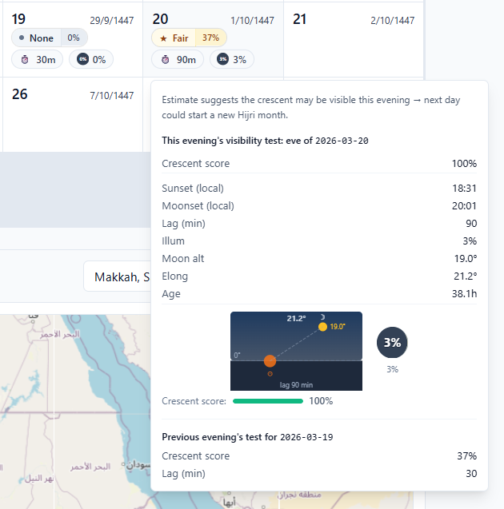
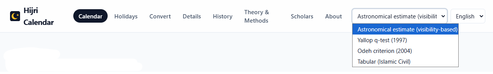

# Hijri Calendar

Open-source web app for exploring the Hijri calendar with location-aware astronomical insights.

- Live: https://sameraamar.github.io/hijri/
- Source: https://github.com/sameraamar/hijri

## Screenshots

| Screenshot | Caption |
|---|---|
|  | **App overview** — Main navigation, method selector, language switcher, and overall layout. |
|  | **Calendar page** — Monthly Hijri/Gregorian view with method selector and location panel. |
|  | **Visibility details popup** — Crescent score breakdown (altitude, elongation, lag, age, illumination). |
|  | **Holidays page** — Year-based Islamic events with visibility likelihood details. |
|  | **Navigation and methods page** — Full top menu with method selector and theory/method options. |

## Features

- Convert Gregorian ↔ Hijri dates
- Browse calendar and holiday/event dates by year
- Estimate crescent visibility with multiple methods
- View astronomical indicators (for selected location/date)
- English + Arabic (RTL), and translation-driven structure for adding more languages

## Implemented methods

Current selectable methods in the app:

- `estimate` (astronomical estimation)
- `yallop`
- `odeh`
- `civil` (tabular/islamic civil)

The project also contains research-oriented content discussing additional published criteria; those should not be interpreted as implemented unless listed above.

## Repository layout

- `apps/web` — React + TypeScript frontend
- `packages/calendar-engine` — shared calculation logic
- `docs` — references and research notes
- `scripts` — data and utility scripts

## Development

Prerequisite:

- Node.js 18+

From repo root:

```bash
npm install
npm run dev
```

Other useful commands:

```bash
npm run build
npm run test
npm run generate:data
```

## Deployment

Production deployment is via GitHub Pages:

- Base path: `/hijri/`
- SPA deep-link fallback: `apps/web/public/404.html`

## SEO and indexing

Included in repo:

- Page metadata and structured data in `apps/web/index.html`
- `robots.txt` at `apps/web/public/robots.txt`
- Sitemap at `apps/web/public/sitemap.xml`

After deployment:

1. Verify URL-prefix property in Google Search Console: `https://sameraamar.github.io/hijri/`
2. Submit sitemap: `https://sameraamar.github.io/hijri/sitemap.xml`
3. Request indexing for the main routes from URL Inspection

## Disclaimer

Astronomical outputs are informational and educational. Official religious announcements may follow local authorities and different conventions.

## License

MIT
